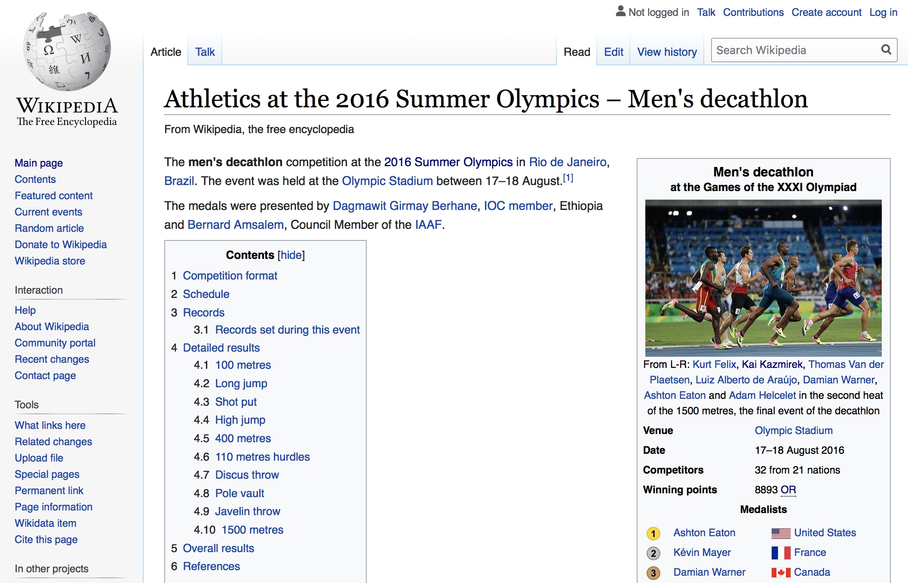
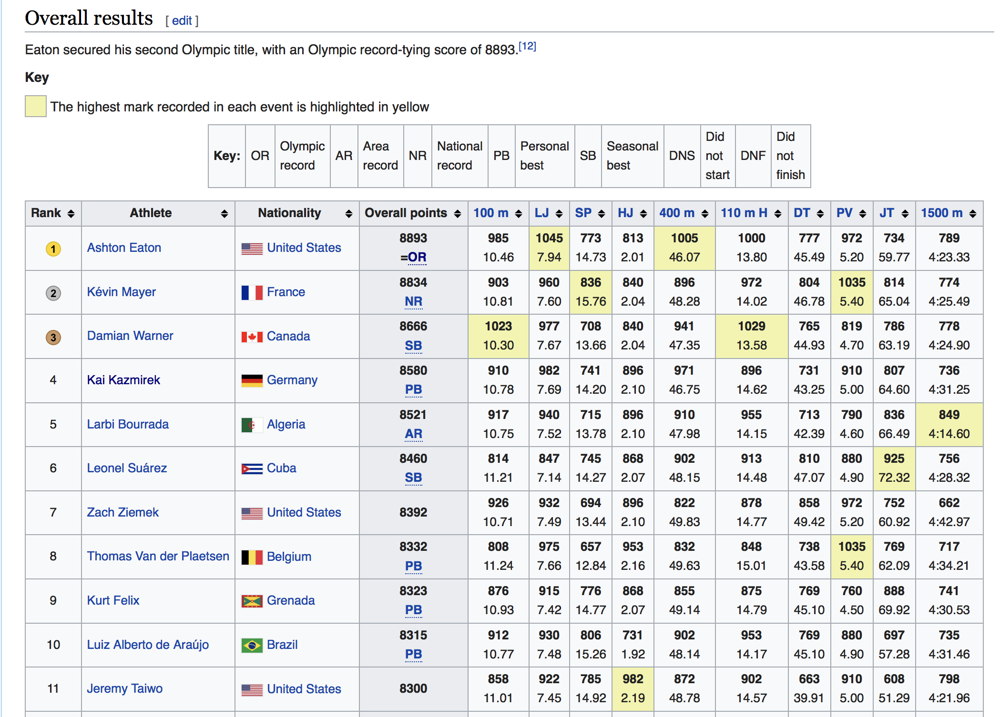
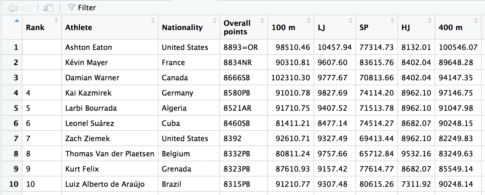
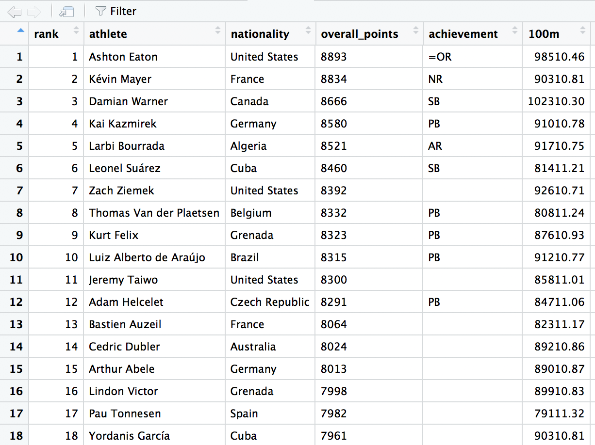
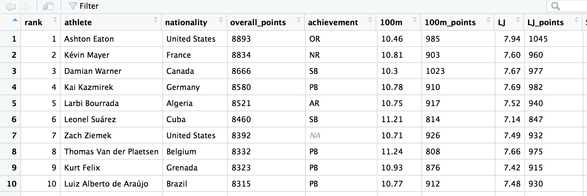

<!-- README.md is generated from README.Rmd. -->

```{r setup, include=FALSE}
library(knitr)
opts_chunk$set(echo = TRUE)
```

# Web Scraping and Data Tidying

## Overview

This repository contains the code for web scraping a Wikipedia page to extract a data set and for subsequently tidying said data. The Wikipedia page to be scraped is [Athletics at the 2016 Summer Olympics – Men's decathlon](https://en.wikipedia.org/wiki/Athletics_at_the_2016_Summer_Olympics_–_Men%27s_decathlon).

```{r, echo=FALSE, out.width = "80%"}

```

I am not interested in all of the data on this page but just the following table near the very bottom of the page.

```{r, echo=FALSE, out.width = "80%"}

```

Before beginning, these packages must be installed:

- `rvest`
- `tidyr`
- `dplyr`

I use the `rvest` package to scrape the Wikipedia page and the packages `tidyr` and `dplyr` for data tidying and manipulation. If you are interested in the R code only, see `dec_rio_2016.R`. 

### Loading packages

```{r, message=FALSE, warning=FALSE}
library(rvest)
library(tidyr)
library(dplyr)
```

### Scraping the web page

To scrape the Wikipedia page, simply supply the url to `read_html()` as a string. The object `rio_dec` now holds the html document. To extract the desired table, use `html_nodes("table")` to select the table nodes of `rio_dec`. `tbls` contains 20 html tables in a list. After a little searching, the 19th table in the list holds the one I want; I use `html_table()` to parse this table into a data frame.

```{r}
rio_dec <- read_html("https://en.wikipedia.org/wiki/Athletics_at_the_2016_Summer_Olympics_%E2%80%93_Men%27s_decathlon")

tbls <- rio_dec %>% 
  html_nodes("table")

dec <- tbls[[19]] %>% 
  html_table()
```

### Data tidying

To see the data in a spreadsheet-style viewer, run

```{r, eval=FALSE}
View(dec)
```

A subset of the rows and columns of `dec` are displayed here with `View()`:

```{r, echo=FALSE, out.width = "80%"}

```

`dec` is definitely messy - there are empty strings in the `Rank` column and strange entries in many of the other columns. To start, I rename some of the columns of `dec`. This is more of a personal preference than anything.

```{r}
names(dec) <- c("rank", "athlete", "nationality",
  "overall_points", "100m", "LJ", "SP", "HJ", "400m",
  "110mH", "DT", "PV", "JT", "1500m")
```

In the `rank` column, I supply the values that were empty strings, recode the missing values symbol `"n/a"` to `NA`, and lastly convert the column to a numeric.

```{r}
dec$rank[1:3] <- 1:3
dec$rank <- na_if(dec$rank, "n/a") %>% 
  as.numeric()
```

In the `overall_points` column, it is clear that when the html table was parsed into a data frame, the overall points and the "achievement" (the olympic record (OR), the national record (NR), etc...) were concatenated into  one string. However, this can be easily fixed by using the `separate()` function from `tidyr` to separate those values into two columns - `overall_points` and `achievement`. The `sep = 4` argument in the function call indicates that the string be split at the fourth position.

```{r}
dec <- separate(dec, overall_points, c("overall_points", "achievement"), sep = 4)
```

```{r, echo = FALSE, out.width="65%"}

```


Looking at the new `achievement` column, notice the first entry is `=OR` and the empty strings are for those athletes who did not achieve a record. Let's modify those entries as follows:

```{r}
dec$achievement <- recode(dec$achievement, "=OR" = "OR")
dec$achievement <- na_if(dec$achievement, "")
dec$achievement
```

For each of the 10 columns representing the events of the decathlon, observe that the marks and the points calculated based on those marks are concatenated into strings. This is where the familiar `tidyr::separate()` function comes in handy. Starting with `100m`, we can split that column into the columns `100m`, which contains the actual marks for that event, and `100m_points`, which contains the points calculated from those marks. However, it is not as easy to separate this column as it was earlier for `overall_points`. Here, regular expressions are employed to separate the columns. A regular expression is a tool to detect patterns in strings. Regular expressions can be tricky to understand, but the "Strings" chapter of [R for Data Science](https://r4ds.had.co.nz/) is an excellent resource for learning how to use them to match patterns. The vignette for the `stringr` package (<https://stringr.tidyverse.org/articles/regular-expressions.html>) is also helpful.

```{r}
dec <- separate(dec, "100m", c("100m_points", "100m"), sep = "(?=\\d{2}[.])")
```

For the other 9 events comprising the decathlon, `separate()` can be called in a similar manner:

```{r,warning=FALSE}
dec <- dec %>% 
  separate(LJ, c("LJ_points", "LJ"), sep = "(?=\\d{1}[.])", 
           convert = TRUE) %>% 
  separate(SP, c("SP_points", "SP"), sep = "(?=\\d{2}[.])|(?=NM)") %>% 
  separate(HJ, c("HJ_points", "HJ"), sep = 3, convert = TRUE) %>% 
  separate(`400m`, c("400m_points", "400m"), sep = "(?=\\d{2}[.])",
           convert = TRUE) %>% 
  separate(`110mH`, c("110mH_points", "110mH"), sep = "(?=\\d{2}[.])",
                  convert = TRUE) %>% 
  separate(DT, c("DT_points", "DT"), sep = "(?=\\d{2}[.])|(?=NM)") %>% 
  separate(PV, c("PV_points", "PV"), sep = "(?=\\d{1}[.])|(?=NM)") %>% 
  separate(JT, c("JT_points", "JT"), sep = "(?=\\d{2}[.])",
           convert = TRUE) %>% 
  separate(`1500m`, c("1500m_points", "1500m"), 
           sep = "(?=\\d{1}\\:)|(?=DNF)")
```

Here, I reorder the column pairs associated with each of 10 events because the marks coming before the points seems more natural.

```{r}
dec <- dec[, c(1:5, as.vector(rbind(seq(7, 25, 2), seq(6, 24, 2))))]
```

```{r, echo = FALSE, out.width="80%"}

```

`dec` is tidy! Visualizing and modeling this data set is now a breeze compared to trying to do those things in its original state. 

One more thing: for the event columns and the columns ending in `_points`, I did not remove any of the **Did Not Finish** (**DNF**), **Did Not Start** (**DNS**), or **No Mark** (**NM**) terms. If you want to visualize or model this data, you will probably want to convert those values into `NA`s first.